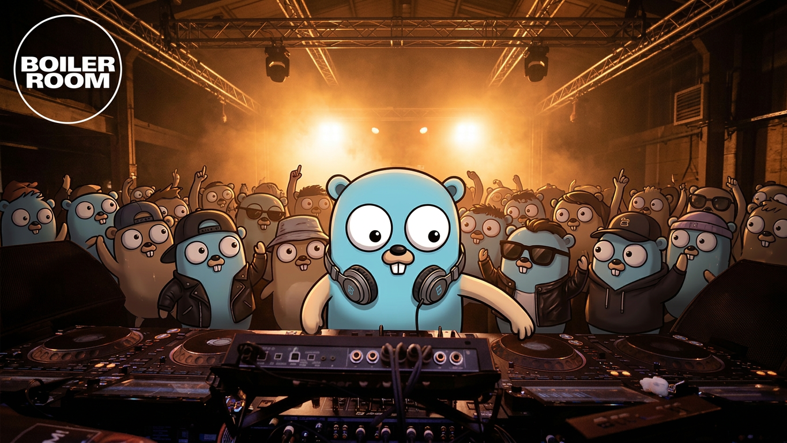

<p align="center">
  
</p>

<h1 align="center">DJ</h1>

<p align="center">
  A terminal multiplexer for <a href="https://github.com/openai/codex">OpenAI Codex CLI</a> agent sessions.
</p>

<p align="center">
  <a href="#install">Install</a> &middot;
  <a href="#quick-start">Quick Start</a> &middot;
  <a href="#keybindings">Keybindings</a> &middot;
  <a href="#configuration">Configuration</a> &middot;
  <a href="#architecture">Architecture</a>
</p>

---

DJ is a Go TUI that visualizes and controls Codex CLI agent sessions on a canvas grid. Think of it as **tmux for AI agents** — a dashboard where each agent session is a card you can inspect, open into a full interactive terminal, fork, or kill.

It communicates with the Codex App Server over JSON-RPC 2.0 via stdio and renders real-time session state using [Bubble Tea](https://github.com/charmbracelet/bubbletea).

## Install

### Homebrew

```bash
brew install robinojw/dj/dj
```

### From source

Requires Go 1.25.4+ and the [Codex CLI](https://github.com/openai/codex) installed in your PATH.

```bash
git clone https://github.com/robinojw/dj.git
cd dj
go build -o dj ./cmd/dj
./dj
```

## Quick Start

```bash
# Launch DJ — it spawns a Codex app server automatically
dj

# Or with a custom config
dj --config dj.toml
```

DJ starts with a canvas grid showing your agent sessions as cards. Use the arrow keys to navigate between cards and press **Enter** to open a full interactive Codex terminal session.

## Keybindings

### Canvas / Tree View

| Key | Action |
|-----|--------|
| `arrow keys` | Navigate cards or tree nodes |
| `Enter` | Open session (spawns or reconnects PTY) |
| `t` | Toggle canvas / tree view |
| `k` | Kill selected session |
| `?` | Help overlay |
| `Esc` / `Ctrl+C` | Quit |

### Prefix Mode (tmux-style)

| Key | Action |
|-----|--------|
| `Ctrl+B` | Enter prefix mode |
| `Ctrl+B` then `m` | Open thread menu (fork / delete / rename) |
| `Ctrl+B` then `n` | Create new thread |

### Session View

| Key | Action |
|-----|--------|
| `Esc` | Close session, return to canvas |
| All other keys | Forwarded to the Codex CLI PTY |

## Configuration

DJ uses an optional TOML config file. All values have sensible defaults.

```toml
[appserver]
command = "codex"
args = ["proto"]

[interactive]
command = "codex"
args = []

[ui]
theme = "default"
```

Pass a custom config with `--config`:

```bash
dj --config ~/my-dj.toml
```

## Architecture

DJ is built on an event-driven [Bubble Tea](https://github.com/charmbracelet/bubbletea) architecture with a reactive `ThreadStore` as the single source of truth.

### Two-process model

1. **Background process** (`codex proto`) — a long-lived JSON-RPC event stream that delivers structured events (session configured, task started, agent deltas, token counts). Updates the ThreadStore which drives canvas card rendering.

2. **Interactive processes** (`codex`) — PTY sessions spawned lazily when you open a card. Each gets a real VT100 terminal emulator ([charmbracelet/x/vt](https://github.com/charmbracelet/x)) so you see actual Codex CLI output.

### Package layout

```
cmd/dj/           Entry point
internal/
  appserver/      JSON-RPC 2.0 client, protocol types, message dispatch
  state/          Reactive ThreadStore (RWMutex-protected), thread state
  config/         Viper-based TOML config loader
  tui/            Bubble Tea UI: canvas grid, tree view, session panel,
                  PTY management, key routing, VT emulator integration
```

### Event flow

```
codex proto stdout
  → Client.ReadLoop()
    → app.events channel
      → Bubble Tea msgs
        → Update() → ThreadStore updated
          → View() re-renders canvas
```

## Development

```bash
# Run all tests
go test ./...

# Single package, verbose
go test ./internal/appserver -v

# Single test
go test ./internal/appserver -run TestClientCall -v

# Integration test (requires codex CLI)
go test ./internal/appserver -v -tags=integration

# Lint
golangci-lint run

# Build
go build -o dj ./cmd/dj
```

CI runs tests with the race detector (`go test -race`) and enforces golangci-lint (govet, staticcheck, funlen, cyclop).

## License

[MIT](LICENSE)
